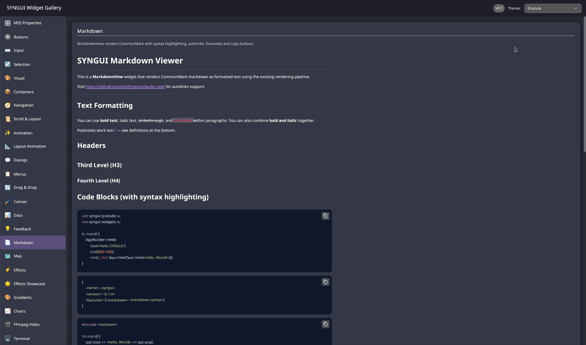

# syngui

A retained-mode GUI framework for Rust — GPU-rendered via wgpu, styled with CSS-like
stylesheets, wired with reactive signals.



```rust
use syngui::prelude::*;
use syngui::widgets::*;

fn main() {
    App::new()
        .title("Hello syngui")
        .size(400, 300)
        .run(|_| Box::new(Text::new("Hello, World!")));
}
```

## Why another Rust GUI

Most Rust GUI libraries make you choose: immediate-mode simplicity (egui) or a retained
tree with typed styling (iced), a custom DSL (Slint) or web tech (Tauri, Dioxus).
syngui takes a different combination — and it's the combination, not any single feature,
that's the point:

- **Real stylesheets.** Not a Rust-typed style struct — an actual cascade. Variables and
  `var()`, type/class/compound selectors, pseudo-classes (`:hover`, `:active`, `:focus`,
  `:checked`, `:disabled`), CSS nesting, descendant selectors, transitions, inheritance.
  Plus window-level pseudo-classes — `:window-maximized`, `:window-fullscreen`,
  `:window-focused` — synced to the window state.
- **Fine-grained reactivity.** SolidJS-style `use_signal` / `use_effect` / `create_memo` /
  `use_context`, with automatic dependency tracking. Signals are `Copy`; subtrees rebuild
  granularly instead of re-running the whole view.
- **Batteries genuinely included.** 70+ widgets across 10 categories, including things
  you normally vendor yourself: charts (line/bar/pie/radar/gauge), a tile map widget with
  pan-zoom, an embedded terminal (PTY + VT100), a markdown view with syntax highlighting,
  a rope-backed code editor, audio and video playback, and a devtools inspector.
- **Retained-mode architecture.** Immutable `Widget` → stateful `Element`, diffed via
  `can_update()`, with dirty-flag propagation (layout / paint / state / children /
  animation). Familiar if you've used Flutter or React.

## Rendering

wgpu 28 (Vulkan / Metal / DX12 / GL / WebGPU) with hand-written WGSL shaders for rects,
text, lines, blur, shadows, and post-processing. The display list is batched by
shader/texture/clip into a handful of draw calls in a single render pass.

## Platforms

Linux (X11 and Wayland — including a hand-rolled Wayland drag-and-drop implementation on
top of `wl_data_device`, since [winit#1881](https://github.com/rust-windowing/winit/issues/1881)
is still open), Windows, macOS, Android, and WebAssembly.

## Styling

```rust
const STYLES: &str = include_str!("../styles/app.mss");

App::new().with_styles_str(STYLES).run(|_| Box::new(build_ui()));
```

```css
:root {
    --accent: #4f8cff;
}

.btn-primary {
    background: var(--accent);
    padding: 8px 16px;
    transition: background 150ms ease-out;

    &:hover { background: #6ea3ff; }
    &:disabled { background: #555; }
}
```

## State

```rust
fn build_ui() -> impl Widget {
    let count = use_context::<RwSignal<i32>>();

    mgui! {
        Column::new().gap(16.0).class("root") => [
            move || {
                let c = count.get();
                Text::new(&format!("Count: {c}"))
            },
            Button::new("Increment")
                .on_click(move || count.set(count.get_untracked() + 1))
                .class("btn-primary"),
        ]
    }
}
```

## Status and honest limitations

This is a young framework built by one person. It is used in production by its author,
has 880+ tests, and carries no `todo!()` stubs — but you should know what's missing
before you adopt it:

- **Text shaping is simple.** Glyph advances are summed per-character. Latin and Cyrillic
  render correctly; there is no kerning, no ligatures, no GSUB/GPOS, no bidirectional text,
  and no complex-script support (Arabic joining, Devanagari reordering). If you need those,
  this framework is not ready for you yet.
- **Accessibility is behind a non-default feature.** AccessKit integration exists
  (AT-SPI / UIA / NSAccessibility) but is not enabled by default and is not continuously
  tested.
- **No CI yet.** Windows, macOS, and Android builds are verified manually.
- **No i18n layer.** Strings are inline; there is no translation mechanism yet.
- **API is not stable.** Expect breaking changes.

## Building

```bash
cargo build -p syngui
cargo test -p syngui
```

The `ffmpeg` feature (video playback) is **not** enabled by default and requires system
FFmpeg 7+ development libraries. Without it, no FFmpeg linkage occurs.

## Examples

Three example apps live under `app/` and depend only on `syngui`:

| App | What it shows |
|-----|---------------|
| `calculator` | Minimal reference app — also carries an **Android** target under `app/calculator/android/` |
| `widget_gallery_mss` | Every widget + MSS styling; also builds to **WebAssembly** |
| `linamp` | A media player — audio, waveforms, richer layout |

**Desktop:**

```bash
cargo run -p calculator
cargo run -p widget_gallery_mss
cargo run -p linamp
```

**Web (WASM)** — builds the gallery to an ES module and serves it:

```bash
rustup target add wasm32-unknown-unknown
cargo install wasm-bindgen-cli
cd app/widget_gallery_mss/web && ./build.sh
python3 -m http.server --directory .   # then open http://localhost:8000
```

The web build omits desktop-only widgets (terminal, video, native clipboard).

**Android** — the `calculator` app ships a Gradle project. Create
`app/calculator/android/local.properties` pointing at your SDK, then build with the
included `gradlew` (requires the Android SDK/NDK and `cargo-ndk`).

## License

Licensed under either of [Apache-2.0](LICENSE-APACHE) or [MIT](LICENSE-MIT) at your
option.
